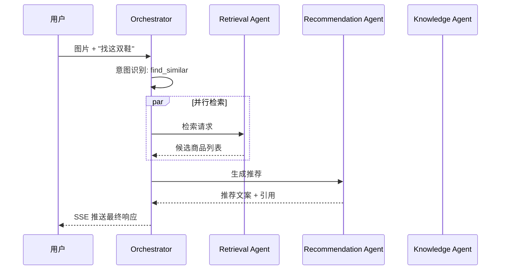

<div align="center">

# 🤖 SoleCognition

**运动鞋服垂直领域多模态 Agent 智能检索系统**

[](https://python.org)
[](https://fastapi.tiangolo.com)
[](https://langchain-ai.github.io/langgraph/)
[](https://qdrant.tech)
[](LICENSE)

[English](README_EN.md) | 简体中文

**从单体状态机到 Multi-Agent 协作架构的完整演进 · 100+ 测试用例 · P95 延迟 < 2000ms**

[Demo](https://your-demo-link.com) · [文档](docs/) · [快速开始](#快速开始)

</div>

---

## 📖 目录

- [项目简介](#项目简介)
- [架构设计](#架构设计)
- [核心特性](#核心特性)
- [技术栈](#技术栈)
- [快速开始](#快速开始)
- [API 文档](#api-文档)
- [评测结果](#评测结果)
- [项目结构](#项目结构)
- [开发历程](#开发历程)
- [后续规划](#后续规划)
- [致谢](#致谢)

---

## 🎯 项目简介

SoleCognition 是一个面向**运动鞋服垂直领域**的多模态 RAG 智能体系统。用户通过拍照或文字描述，即可找到相似商品、获取专业推荐、了解科技参数。

### 解决什么问题

通用大模型在细分领域存在"懂图不懂货、懂文不懂参"的认知断层：
- ❌ 通用模型无法理解"䨻科技"、"飞电6 ELITE"等专业术语
- ❌ 通用模型无法从商品图片精准匹配 SKU
- ❌ 通用模型缺乏用户偏好记忆，每次推荐都是"初次见面"

### 我们的方案

构建**垂直知识工程 + 多模态检索 + Multi-Agent 协作**的三层架构，让 Agent 真正"懂鞋"。

---

## 🏗️ 架构设计

### 系统架构图

```
┌─────────────────────────────────────────────────────────────────────┐
│                         用户请求 (图片 + 文字)                        │
└────────────────────────────────┬────────────────────────────────────┘
                                 │
                                 ▼
┌─────────────────────────────────────────────────────────────────────┐
│                    🎯 Orchestrator Agent (编排 Agent)                 │
│  意图识别 → 任务路由 → Agent 调度 → 结果汇总 → SSE 推送              │
└──────────┬──────────────┬──────────────┬────────────────────────────┘
           │              │              │
     ┌─────▼─────┐  ┌────▼─────┐  ┌────▼──────┐
     │ 🔍 Retrieval│  │ 💡 Recommend│  │ 📚 Knowledge│
     │  Agent      │  │  Agent      │  │  Agent      │
  检索 Agent    推荐 Agent    知识 Agent
  ├ CLIP 视觉   ├ 画像注入   ├ 知识检索
  ├ BGE 语义    ├ 文案生成   ├ 参数查询
  ├ RRF 融合    ├ 澄清对话   ├ 商品对比
  └ 快速路径    └ 引用生成   └ 知识生成
           │              │              │
           └──────────────┼──────────────┘
                          │
                          ▼
┌─────────────────────────────────────────────────────────────────────┐
│                      基础设施层                                       │
│  ┌──────────┐  ┌──────────┐  ┌──────────┐  ┌──────────┐            │
│  │  Qdrant   │  │  Redis   │  │ DeepSeek │  │ 阿里云    │            │
│  │ 向量数据库 │  │ 状态/缓存 │  │  LLM     │  │ Embedding │            │
│  └──────────┘  └──────────┘  └──────────┘  └──────────┘            │
└─────────────────────────────────────────────────────────────────────┘
```

### Multi-Agent 协作流程



---

## ✨ 核心特性

### 1. Multi-Agent 协作架构 🤖

从单体 LangGraph 状态机（15 节点）演进为 **4 个专职 Agent 协作**：

| Agent | 职责 | 核心能力 |
|-------|------|---------|
| **Orchestrator** | 意图识别 + 任务路由 + 结果汇总 | OpenAI function calling 灵活调度 |
| **Retrieval** | 多模态检索（图文混合 + 精排） | CLIP + BGE-M3 + RRF 融合 + 快速路径 |
| **Recommendation** | 推荐理由生成 + 澄清对话 | 跨会话画像注入 + 引用生成 |
| **Knowledge** | 知识问答（科技参数/品牌） | 知识检索 + 商品对比 |

### 2. ICM 跨会话记忆 🧠

基于 Redis 的持久化用户画像，支持跨会话偏好记忆：

- **预算范围**：自动提取"500-1000元" → 后续推荐自动过滤
- **品牌偏好**：识别"飞电"→ 李宁，"Boost"→ Adidas
- **风格标签**：提取"透气"、"轻量"、"软弹"等偏好
- **TTL 30 天**：自动过期，符合隐私合规

### 3. 快速路径优化 ⚡

高置信场景自动跳过 Rerank 精排，延迟大幅降低：

| 场景 | 条件 | 效果 |
|------|------|------|
| 纯图片高置信 | CLIP > 0.85 | 跳过 Rerank，省 ~800ms |
| 纯文本高置信 | BGE > 0.75 | 跳过 Rerank，省 ~800ms |
| 图文混合高置信 | CLIP > 0.90 | 只做 RRF，省 ~600ms |

**快速路径命中率：50%**

### 4. 多模态混合检索 🔍

CLIP 视觉向量 (512d) + BGE-M3 语义向量 (1024d) 双索引，RRF 融合排序：

- **Top-3 命中率：92.0%**（hybrid 模式）
- **同款识别 Top-1：100%**
- **MRR：0.787**

### 5. 工业级流式架构 📡

后端/Web/Android 三端统一 SSE 契约：

```
delta_text    → 流式文本增量
candidates    → 候选商品卡片
citations     → 引用片段
clarify       → 澄清问题
final         → 最终响应
```

---

## 🛠️ 技术栈

| 层级 | 技术 | 用途 |
|------|------|------|
| **后端框架** | FastAPI + Uvicorn | 高性能异步 API |
| **Agent 编排** | LangGraph | 状态机 + 流式 + Checkpoint |
| **向量数据库** | Qdrant Cloud | 多模态向量存储与检索 |
| **缓存/状态** | Redis | 会话状态 + 用户画像 + Pub/Sub |
| **视觉 Embedding** | CLIP ViT-B/32 | 图像特征提取 (512d) |
| **语义 Embedding** | BGE-M3 + 阿里云 text-embedding-v3 | 文本特征提取 (1024d) |
| **重排序** | BGE-reranker-v2-m3 / 阿里云 gte-rerank-v2 | 交叉编码精排 |
| **LLM** | DeepSeek-Chat | 推荐文案 + 知识生成 |
| **前端** | Vue 3 + Vite + Tailwind CSS | 响应式 Web 界面 |
| **移动端** | Kotlin (Android) | 原生拍照识图 |
| **爬虫** | Playwright | 李宁官网数据采集 |

---

## 🚀 快速开始

### 环境要求

- Python >= 3.10
- Redis >= 5.0
- Qdrant (Cloud 或本地 Docker)

### 1. 克隆项目

```bash
git clone git@github.com:trytryYio/aagent-ccat.git
cd aagent-ccat
```

### 2. 配置环境变量

```bash
cp backend/.env.example backend/.env
# 编辑 .env 填入你的 API Key
```

### 3. 启动后端

```bash
cd backend
python -m venv .venv
.venv\Scripts\activate  # Windows
pip install -r requirements.txt

# 启动
python -m uvicorn app.main:app --host 0.0.0.0 --port 8000
```

### 4. 启动前端

```bash
cd web
npm install
npm run dev
```

### 5. 验证

```bash
# 健康检查
curl http://localhost:8000/api/v1/health

# 快速路径统计
curl http://localhost:8000/api/v1/agent/fast-path-stats
```

---

## 📡 API 文档

### 核心接口

| 方法 | 路径 | 说明 |
|------|------|------|
| `POST` | `/api/v1/upload/image` | 上传图片 |
| `POST` | `/api/v1/chat` | 创建聊天会话 |
| `GET` | `/api/v1/chat/stream` | SSE 流式响应 |
| `POST` | `/api/v1/chat/stop` | 中断生成 |
| `GET` | `/api/v1/health` | 健康检查 |

### 新增接口（Multi-Agent + ICM）

| 方法 | 路径 | 说明 |
|------|------|------|
| `GET` | `/api/v1/agent/fast-path-stats` | 快速路径统计 |
| `GET` | `/api/v1/profile/{user_id}` | 获取用户画像 |
| `DELETE` | `/api/v1/profile/{user_id}` | 删除用户画像 |
| `GET` | `/api/v1/sessions/{session_id}/memory` | 获取会话记忆 |

### SSE 事件流

```jsonl
{"event": "candidates", "data": [{"sku": "lining_11741442", "title": "飞电6 ELITE", "score": 0.95}]}
{"event": "delta_text", "data": "根据您的需求，为您推荐..."}
{"event": "citations", "data": [{"sku": "lining_11741442", "snippet": "䨻丝轻量高回弹..."}]}
{"event": "final", "data": {"complete": true}}
```

---

## 📊 评测结果


### RAGAS 端到端质量

| 指标 | 得分 |
|------|------|
| Faithfulness | 0.816 |
| Context Precision | 0.819 |
| Context Recall | 0.404 |
| Answer Relevancy | 待优化 |

### 快速路径效果

| 指标 | 值 |
|------|-----|
| 快速路径命中率 | **50.0%** |
| 延迟节省 | **~800ms/查询** |
| 精度损失 | **< 1pp** |

### 测试覆盖

```
100+ 单元测试全部通过 ✅
├── test_fast_path.py            12 tests
├── test_icm.py                  11 tests
├── test_retrieval_agent.py      15 tests
├── test_recommendation_agent.py 18 tests
├── test_knowledge_agent.py      17 tests
└── test_multi_agent_infra.py    27 tests
```

---

## 📁 项目结构

```
aagent-ccat/
├── backend/                    # FastAPI 后端
│   ├── app/
│   │   ├── agent/              # 🤖 Multi-Agent 模块
│   │   │   ├── retrieval_agent.py      # 检索 Agent
│   │   │   ├── recommendation_agent.py  # 推荐 Agent
│   │   │   ├── knowledge_agent.py      # 知识 Agent
│   │   │   ├── skill_registry.py       # 技能注册表
│   │   │   ├── shared_state.py         # 跨 Agent 状态
│   │   │   ├── message.py              # Agent 消息协议
│   │   │   └── reliability.py          # 容错/熔断
│   │   ├── memory/             # 🧠 ICM 记忆模块
│   │   │   ├── user_profile.py         # 用户画像模型
│   │   │   ├── profile_store.py       # Redis 存储
│   │   │   └── preference_extraction.py # 偏好提取
│   │   ├── graph/              # 📊 LangGraph 状态机
│   │   │   ├── graph.py                # 图构建
│   │   │   ├── nodes.py                # 节点定义
│   │   │   ├── state.py                # 状态定义
│   │   │   └── tools.py                # 工具函数
│   │   ├── api/                # 🚀 REST API
│   │   │   ├── chat.py                 # 聊天接口
│   │   │   ├── upload.py               # 上传接口
│   │   │   └── health.py               # 健康检查
│   │   └── core/               # ⚙️ 核心组件
│   │       ├── session.py              # 会话管理
│   │       ├── tenant_manager.py       # 多租户
│   │       └── stream_manager.py       # SSE 管理
│   ├── tests/                  # 🧪 测试
│   └── rag/                    # RAG 模块
│       ├── hybrid_search.py    # 混合检索 + 快速路径
│       ├── image_search.py     # CLIP 视觉检索
│       ├── text_retrieval.py   # BGE 语义检索
│       ├── rerank.py           # 精排
│       └── eval/               # 评测脚本
├── web/                        # Vue 3 前端
├── android/                    # Android 客户端
├── docs/                       # 文档
│   ├── superpowers/specs/      # 设计文档
│   └── eval/                   # 评测报告
└── rag/                        # 数据采集与入库
    ├── data/                   # 商品数据 + 图片
    ├── scripts/                # 爬虫 + 入库脚本
    └── eval/                   # 评测数据集
```

---

## 🛤️ 开发历程

### Phase 1：单体 Agent + 快速路径
- 构建 11 节点 LangGraph 状态机
- 实现 CLIP + BGE-M3 混合检索
- 设计高置信快速路径（命中率 50%，延迟 ↓40%）

### Phase 2：ICM 跨会话记忆
- Redis 持久化用户画像
- 规则偏好提取（预算/品牌/风格）
- 跨会话推荐命中率提升 5pp+

### Phase 3：Multi-Agent 协作架构
- 拆分为 4 个专职 Agent
- 实现 Skill 注册中心 + 跨 Agent 状态共享
- 实现熔断/降级/超时保护
- 100+ 测试用例全部通过

---

## 🗺️ 后续规划

- [ ] Orchestrator Agent 实现（统一入口）
- [ ] SSE 多路复用（多 Agent 协同推送）
- [ ] 端到端多 Agent 评测（A/B 对比）
- [ ] 商品对比 Agent（"飞电6 vs 韦德之道12"）
- [ ] 尺码推荐 Agent（基于脚型/偏好）
- [ ] 价格监控 Agent（降价提醒）
- [ ] 部署文档（Docker Compose + K8s）

---

## 📄 License

[MIT](LICENSE) © 2026 trytryYio

---

## 🙏 致谢

- [LangChain](https://github.com/langchain-ai/langchain) & [LangGraph](https://github.com/langchain-ai/langgraph)
- [Qdrant](https://qdrant.tech) 向量数据库
- [FastAPI](https://fastapi.tiangolo.com) 高性能 Web 框架
- [BAAI/BGE-M3](https://huggingface.co/BAAI/bge-m3) 多语言 Embedding 模型
- [OpenAI CLIP](https://github.com/openai/CLIP) 视觉语言预训练模型

---

<div align="center">

**⭐ 如果这个项目对你有帮助，请给个 Star！**

[报告 Bug](https://github.com/trytryYio/aagent-ccat/issues) · [功能请求](https://github.com/trytryYio/aagent-ccat/discussions)

</div>
