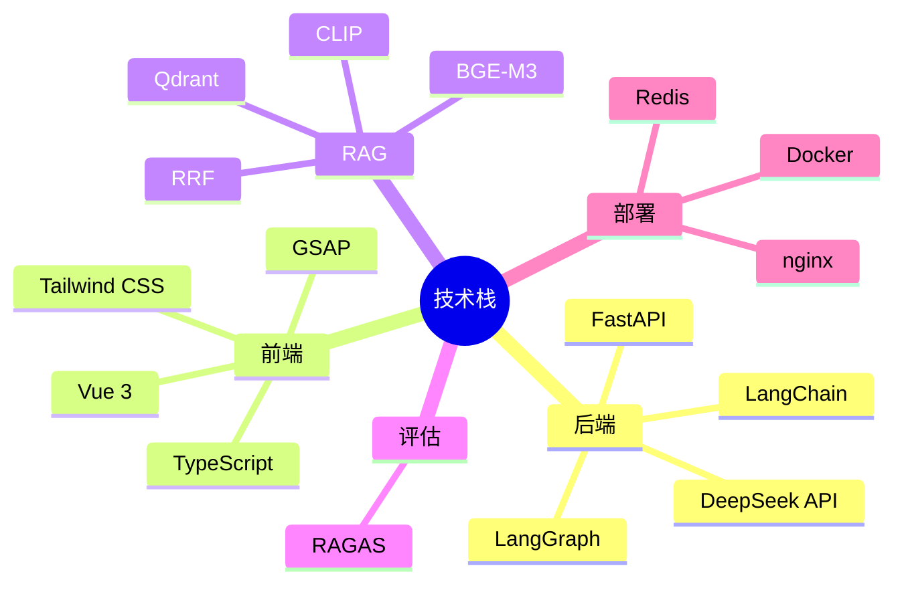
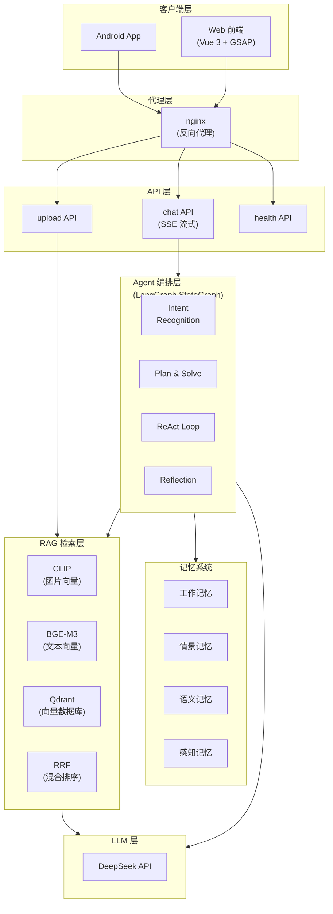
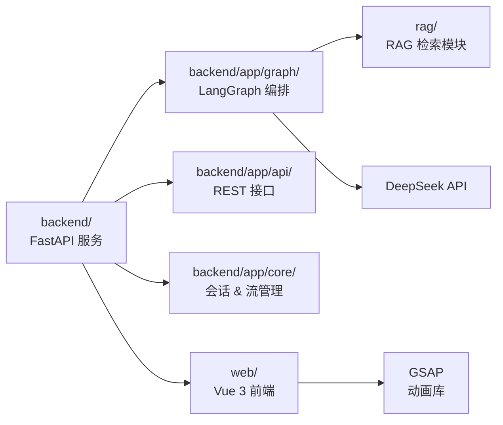

# 01 - 项目概述与整体架构

## 本节目标

学完本节你能够：理解整个"拍照识图 + RAG 电商导购 Agent"项目的业务背景、技术选型理由，以及前后端分离 + 多 Agent 编排的整体架构。

---

## 业务背景

用户用 Android 手机拍照（或选图），上传到系统后，系统自动识别商品并返回 top-K 相似商品推荐 + 流式导购回答 + 知识引用。

**核心场景：**
1. **找同款** — 拍一张鞋的照片，找到同款商品
2. **找替代** — 拍照后按预算/偏好推荐近似商品
3. **不确定澄清** — 系统无法确定时主动追问用户

## 技术栈总览



## 系统架构图



## 模块依赖关系



## 关键的架构决策

| 决策 | 选择 | 理由 |
|------|------|------|
| Agent 框架 | LangGraph StateGraph | 可视化、可控、支持中断/恢复 |
| 向量化 | CLIP(512d) + BGE-M3(1024d) | 多模态、双向量 |
| 记忆 | 四层架构 | 分层清晰、各层独立 |
| 前端动画 | GSAP | 轻量、高性能、Vue 友好 |
| 评测 | RAGAS | 四维量化、LLM-as-Judge |

## 运行验证

```bash
# Docker 一键启动
docker compose up --build -d

# 验证服务
curl http://localhost/api/v1/health
# 预期: {"status":"ok",...}
```

## 小结

- 项目是"前后端分离 + LangGraph 编排 + RAG 检索 + LLM 生成"的四层架构
- 前端用 Vue 3 + GSAP 提供交互体验
- 后端用 FastAPI + LangGraph 做智能编排
- RAG 模块提供多模态检索能力
- 所有服务通过 Docker 容器化一键启动