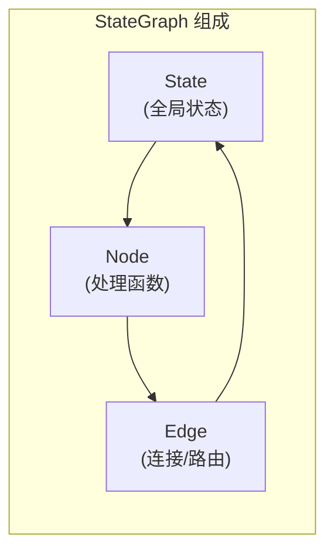
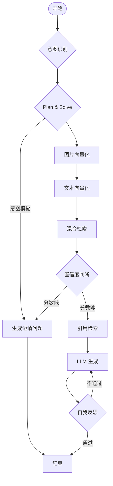
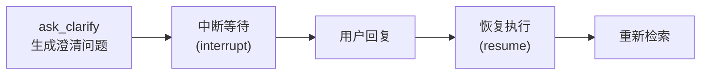

# 02 - LangGraph 智能体编排

## 本节目标

学完本节你能够：理解 LangGraph StateGraph 的核心概念，掌握多 Agent 编排中的意图识别、Plan & Solve、ReAct 循环和 Reflection 机制。

---

## StateGraph 核心概念

LangGraph 的核心是一个**有向状态图**（StateGraph），包含三个基本元素：



| 元素 | 说明 | 示例 |
|------|------|------|
| **State** | 贯穿整个图的数据对象 | AgentState（用户输入、检索结果、生成文本等） |
| **Node** | 一个处理步骤/函数 | intent_recognition_node, search_node, generate_node |
| **Edge** | Node 之间的连接 | add_edge()、add_conditional_edges() |

## 本项目 StateGraph 全景图



## 各 Node 详解

### 1. 意图识别节点

```python
async def intent_recognition_node(state: AgentState) -> AgentState:
    """用 LLM 判断用户意图"""
    prompt = """
    根据用户输入判断意图：
    - find_similar: 用户上传了图片，想找同款
    - ask_product: 用户询问商品详情
    - compare: 用户要求对比
    - unclear: 无法确定
    """
    llm = get_llm()
    response = await llm.ainvoke(prompt)
    state["intent"] = response.content.strip().lower()
    return state
```

### 2. Plan & Solve 节点

根据意图生成执行计划：

```python
async def plan_node(state: AgentState) -> AgentState:
    intent = state.get("intent", "unclear")
    plans = {
        "find_similar": ["embed_image", "search", "retrieve_citations", "generate"],
        "ask_product": ["embed_image", "search", "retrieve_citations", "generate"],
        "unclear": ["ask_clarify"],
    }
    state["plan"] = plans.get(intent, ["ask_clarify"])
    return state
```

### 3. ReAct 循环节点

生成回答节点是 ReAct 循环的体现——Think（LLM 推理）→ Act（无工具调用则直接输出）→ Observe（检查输出）：

```python
async def generate_node(state: AgentState) -> AgentState:
    # Think: 构建 prompt
    messages = [{"role": "system", "content": system_prompt}]
    messages.append({"role": "user", "content": text or "推荐类似的产品"})

    # Act + Observe: LLM 流式生成
    llm = get_llm(streaming=True)
    full_response = ""
    async for chunk in llm.astream(messages):
        content = chunk.content or ""
        if content:
            full_response += content
    state["final_answer"] = full_response
    return state
```

### 4. Reflection 反思节点

生成回答后做自我检查：

```python
async def reflection_node(state: AgentState) -> AgentState:
    prompt = f"""
    检查以下回答是否符合要求：
    1. 是否基于候选商品？
    2. 是否引用了知识？
    3. 是否有编造的内容？

    回答：{state['final_answer'][:500]}

    如果合格只输出 PASS，否则说明具体问题。
    """
    llm = get_llm(temperature=0.1)
    response = await llm.ainvoke(prompt)
    state["reflection_passed"] = response.content.strip().upper().startswith("PASS")
    return state
```

## StateGraph 构建代码

```python
from langgraph.graph import StateGraph, END

builder = StateGraph(AgentState)

# 注册所有节点
builder.add_node("intent_recognition", intent_recognition_node)
builder.add_node("plan", plan_node)
builder.add_node("embed_image", embed_image_node)
builder.add_node("search", search_node)
# ... 更多节点

# 连接边
builder.set_entry_point("intent_recognition")
builder.add_edge("intent_recognition", "plan")

# 条件路由
builder.add_conditional_edges(
    "decide_clarify",
    router,  # 返回 "clarify" 或 "continue"
    {"clarify": "ask_clarify", "continue": "retrieve_citations"},
)

# 编译
graph = builder.compile(checkpointer=MemorySaver())
```

## Graph Interrupt 机制



## 运行验证

```bash
cd backend && source .venv/bin/activate && cd ..
PYTHONPATH=$(pwd) python -c "
from app.graph.graph import agent_graph
print(agent_graph.get_graph().draw_mermaid())
"
```

## 小结

- LangGraph StateGraph = State + Node + Edge
- 意图识别 → Plan → ReAct → Reflection 构成完整的多 Agent 编排链路
- 条件路由支持澄清循环和反思重试
- Graph Interrupt 实现"等待用户澄清"的场景