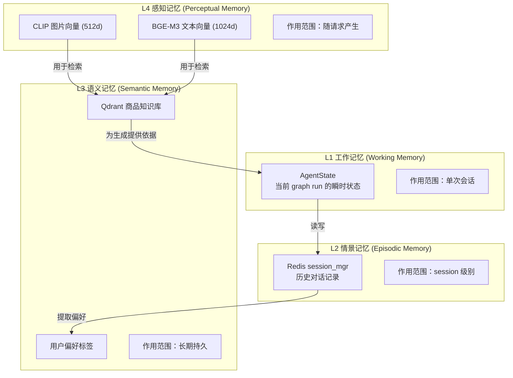
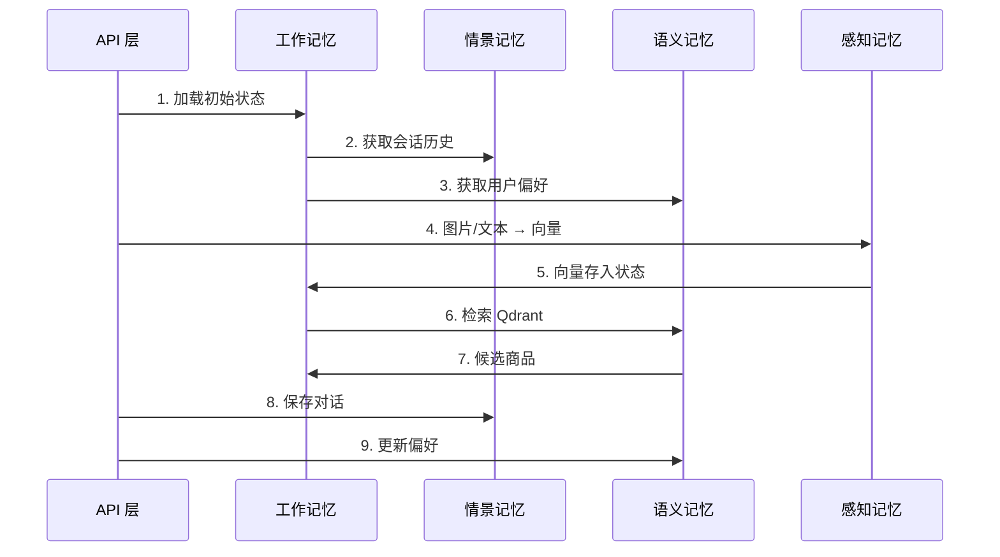

# 03 - Agent 四层记忆系统

## 本节目标

学完本节你能够：理解工作记忆、情景记忆、语义记忆、感知记忆四层架构的设计思想与实现方式。

---

## 记忆系统架构总览



## 四层记忆详细设计

### L1: 工作记忆

```python
class WorkingMemory:
    """当前 graph run 的瞬时状态"""
    @staticmethod
    def init_state(session_id, image_id=None, text=None):
        return {
            "image_id": image_id,
            "text": text or "",
            "session_id": session_id,
            "candidates": [],      # 检索结果
            "citations": [],       # 引用片段
            "intent": "",          # 识别到的意图
            "plan": [],            # 执行计划
            "final_answer": None,  # 最终回答
            "need_clarify": False, # 是否需要澄清
        }
```

### L2: 情景记忆

```python
class EpisodicMemory:
    """会话历史（Redis）"""
    @staticmethod
    def get_or_create_session(session_id):
        return session_mgr.get_or_create(session_id)

    @staticmethod
    def append_history(session_id, message):
        """保存一条对话记录"""
        session_mgr.append_history(session_id, message)
```

### L3: 语义记忆

```python
class SemanticMemory:
    """用户偏好 + 商品知识"""
    @staticmethod
    def extract_preferences(history):
        """从历史对话中提取用户偏好"""
        return extract_preferences(history)

    @staticmethod
    def get_preferences(session_id):
        """获取用户偏好"""
        session = session_mgr.get_session(session_id)
        return session.preferences if session else {}
```

### L4: 感知记忆

由 `nodes.py` 中的 `embed_image_node` / `embed_text_node` 处理，将感知输入转化为向量。

## 记忆数据流



## 状态加载与保存

```python
def load_memory_to_state(session_id, image_id, text):
    """从四层记忆加载初始状态"""
    state = WorkingMemory.init_state(session_id, image_id, text)
    session = EpisodicMemory.get_or_create_session(session_id)
    state["history"] = session.history[-6:]
    state["preferences"] = SemanticMemory.get_preferences(session_id)
    return state

def save_memory_from_state(state):
    """将执行结果写回记忆系统"""
    if state.get("final_answer"):
        EpisodicMemory.append_history(session_id, {"role": "user", ...})
        EpisodicMemory.append_history(session_id, {"role": "assistant", ...})
    # 提取偏好
    session.preferences.update(
        SemanticMemory.extract_preferences(session.history)
    )
```

## 小结

- **工作记忆** = AgentState（一次 graph run 的瞬时状态）
- **情景记忆** = Redis session_mgr（历史对话）
- **语义记忆** = 用户偏好 + Qdrant 知识库（长期持久）
- **感知记忆** = CLIP/BGE-M3 向量（感知输入→向量）
- 四层记忆通过 `load_memory_to_state` / `save_memory_from_state` 统一读写