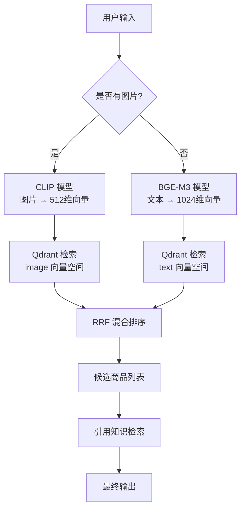
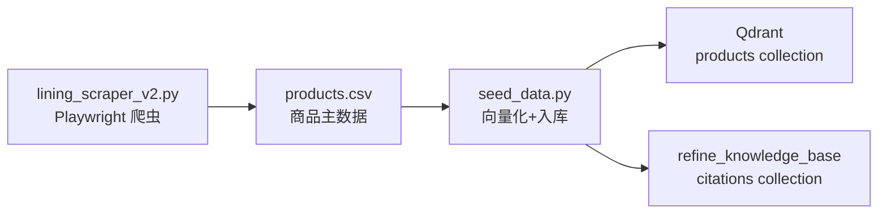

# 04 - 多模态 RAG 检索实现

## 本节目标

学完本节你能够：理解 CLIP 和 BGE-M3 的多模态向量化原理、Qdrant 向量检索与 RRF 混合排序的实现方式。

---

## 检索流程总览



## 向量模型

| 模型 | 用途 | 输出维度 | 加载方式 |
|------|------|---------|---------|
| **CLIP ViT-B/32** | 图片向量化 | 512 维 | 单例模式，服务启动时加载 |
| **BGE-M3** | 文本向量化 | 1024 维 | 延迟加载（首次 embed_text 时） |

```python
from sentence_transformers import SentenceTransformer

class EmbeddingEngine:
    _instance = None
    
    def _init_models(self):
        # CLIP: 图片向量
        self.clip_model = SentenceTransformer("clip-ViT-B-32")
        # BGE-M3: 文本向量（延迟加载）
        self.bge_model = None
        
    def embed_image(self, image_bytes: bytes) -> list[float]:
        """图片 → CLIP 512维向量"""
        from PIL import Image
        import io
        image = Image.open(io.BytesIO(image_bytes))
        return self.clip_model.encode(image).tolist()
    
    def embed_text(self, text: str) -> list[float]:
        """文本 → BGE-M3 1024维向量"""
        if self.bge_model is None:
            self.bge_model = SentenceTransformer("BAAI/bge-m3")
        return self.bge_model.encode(text).tolist()
```

## Qdrant 向量库配置

```python
from qdrant_client.models import VectorParams, Distance

# 双向量方案：一个 point 同时存 image + text 向量
client.recreate_collection(
    collection_name="products",
    vectors_config={
        "text": VectorParams(size=1024, distance=Distance.COSINE),
        "image": VectorParams(size=512, distance=Distance.COSINE),
    },
)
```

## RRF 混合检索

```python
def hybrid_search(image_embedding, text_embedding, top_k=10, rrf_k=60):
    """RRF (Reciprocal Rank Fusion) 混合排序"""
    # 1. 分别执行检索
    image_results = search_by_image(image_embedding, top_k * 2)
    text_results = search_by_text(text_embedding, top_k * 2)
    
    # 2. RRF 融合排序
    # score = sum(1 / (rrf_k + rank))
    rrf_scores = {}
    for rank, result in enumerate(image_results):
        rrf_scores[result.product_id] = 1 / (rrf_k + rank + 1)
    for rank, result in enumerate(text_results):
        rrf_scores[result.product_id] = (
            rrf_scores.get(result.product_id, 0) + 1 / (rrf_k + rank + 1)
        )
    
    # 3. 按 RRF 分数排序取 top_k
    sorted_ids = sorted(rrf_scores, key=rrf_scores.get, reverse=True)[:top_k]
    return [all_results[pid] for pid in sorted_ids]
```

## 引用知识检索

```python
async def retrieve_citations_tool(sku_ids, query_text=""):
    """检索引用知识片段"""
    if query_text:
        # 语义检索引用
        query_emb = embed_text(query_text)
        citations = get_citations(query_emb, sku_ids, top_k=5)
    if not citations:
        # 直接按 SKU 取引用
        citations = get_citations_by_sku(sku_ids[0])
    return citations
```

## 数据采集流程



## 小结

- CLIP 处理图片（512 维），BGE-M3 处理文本（1024 维）
- Qdrant 使用 named vectors 方案，一个 point 存双向量
- RRF 融合两路检索结果，提升准确率
- 引用检索支持语义检索 + 直接取两种方式