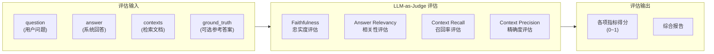
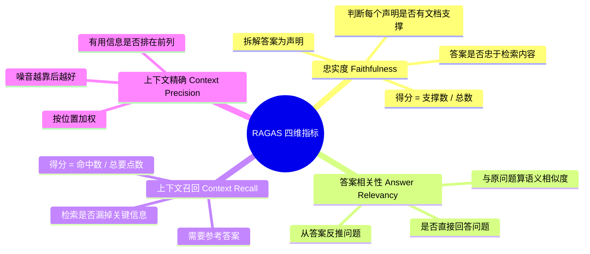

# 05 - RAGAS 质量评估

## 本节目标

学完本节你能够：理解 RAGAS 四维评估指标的含义，掌握如何对 RAG 系统进行自动化质量评估。

---

## RAGAS 评估原理

RAGAS（Retrieval Augmented Generation Assessment）的核心思想是 **LLM-as-Judge**——让大语言模型作为评卷老师，对 RAG 系统的输出进行打分。



## 四维指标详解



## 评估流水线

```python
from datasets import Dataset
from ragas import evaluate
from ragas.metrics import (
    faithfulness,
    answer_relevancy,
    context_recall,
    context_precision,
)
from ragas.llms import LangchainLLMWrapper
from langchain_openai import ChatOpenAI

# 1. 准备数据
data = {
    "question": ["量子纠缠是什么？"],
    "answer": ["量子纠缠是两个粒子间的关联现象..."],
    "contexts": [["量子纠缠是量子力学中的特殊关联..."]],
    "ground_truth": ["量子纠缠是一种量子力学现象"],
}
dataset = Dataset.from_dict(data)

# 2. 配置评估 LLM
eval_llm = ChatOpenAI(
    model="deepseek-chat",
    api_key="...",
    base_url="https://api.deepseek.com/v1",
    temperature=0.1,
)

# 3. 执行评估
metrics = [faithfulness, answer_relevancy, context_recall, context_precision]
result = evaluate(dataset, metrics=metrics, llm=LangchainLLMWrapper(eval_llm))

# 4. 输出结果
print(result)
# {'faithfulness': 0.95, 'answer_relevancy': 0.88, ...}
```

## 评估报告格式

```json
{
  "run_id": "20260614_120000",
  "metrics": {
    "faithfulness": 0.92,
    "answer_relevancy": 0.85,
    "context_recall": 0.78,
    "context_precision": 0.81
  },
  "num_cases": 10
}
```

## 运行评估

```bash
# 安装依赖
source backend/.venv/bin/activate
pip install ragas datasets

# 运行评估
PYTHONPATH=$(pwd) python rag/eval/ragas_eval.py

# 自定义数据集
PYTHONPATH=$(pwd) python rag/eval/ragas_eval.py \\
  --dataset rag/eval/datasets/rag_eval_dataset.jsonl \\
  --output-dir rag/eval/reports
```

## 小结

- RAGAS 用 Faithfulness、Answer Relevancy、Context Recall、Context Precision 四个维度量化评估
- LLM-as-Judge 模式无需人工标注
- 评估结果输出 JSON + Markdown 双格式报告
- 可集成到 CI 流程中做回归测试

