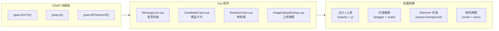

# 06 - GSAP 前端动效优化

## 本节目标

学完本节你能够：理解 GSAP 动画库的核心用法，掌握如何在 Vue 3 组件中接入动画。

---

## 动画设计概览



## 核心动画实现

### 1. 消息入场动画

```typescript
import { gsap } from 'gsap'

export function useMessageAnimation() {
  const animateIn = (el: HTMLElement, delay: number = 0) => {
    gsap.fromTo(
      el,
      { opacity: 0, y: 20 },           // 从透明+下方20px开始
      { opacity: 1, y: 0,               // 到完全不透明+原始位置
        duration: 0.4, delay, 
        ease: 'power2.out' }            // 缓动函数
    )
  }
  return { animateIn }
}
```

### 2. 卡片交错动画

```typescript
export function useCardStagger() {
  const animateCards = (els: HTMLElement[]) => {
    gsap.fromTo(
      els,
      { opacity: 0, scale: 0.8, y: 30 },
      {
        opacity: 1, scale: 1, y: 0,
        duration: 0.35,
        stagger: 0.08,                  // 每张卡延迟0.08秒
        ease: 'back.out(1.5)',          // 弹性回弹效果
      }
    )
  }
  return { animateCards }
}
```

### 3. Shimmer 骨架屏

```typescript
export function useShimmerAnimation() {
  const startShimmer = (el: HTMLElement) => {
    gsap.to(el, {
      backgroundPosition: '200% 0',     // 背景从左移到右
      duration: 1.5,
      repeat: -1,                       // 无限循环
      ease: 'none',
    })
  }
  const stopShimmer = (el: HTMLElement) => {
    gsap.killTweensOf(el)              // 停止动画
  }
  return { startShimmer, stopShimmer }
}
```

### 4. 弹窗动效

```typescript
export function useDialogAnimation() {
  const animateIn = (el: HTMLElement) => {
    gsap.fromTo(el,
      { opacity: 0, scale: 0.9 },
      { opacity: 1, scale: 1, duration: 0.3, ease: 'power2.out' }
    )
  }
  const animateOut = (el: HTMLElement) => {
    gsap.to(el,
      { opacity: 0, scale: 0.9, duration: 0.2, ease: 'power2.in' }
    )
  }
  return { animateIn, animateOut }
}
```

## 在 Vue 组件中接入

```vue
<script setup lang="ts">
import { onMounted, ref } from 'vue'
import { useMessageAnimation } from '../composables/useGSAP'

const bubbleRef = ref<HTMLElement | null>(null)
const { animateIn } = useMessageAnimation()

onMounted(() => {
  if (bubbleRef.value) {
    animateIn(bubbleRef.value)
  }
})
</script>

<template>
  <div ref="bubbleRef" class="message-bubble">
    <!-- 消息内容 -->
  </div>
</template>
```

## GSAP API 速查

| API | 用途 | 参数 |
|-----|------|------|
| `gsap.to(el, vars)` | 从当前状态过渡到目标状态 | `{duration, opacity, x, y, ease}` |
| `gsap.fromTo(el, from, to)` | 从指定状态过渡到目标状态 | `from` + `to` 对象 |
| `gsap.killTweensOf(el)` | 停止某个元素的所有动画 | 元素引用 |
| `stagger` | 多个元素的交错延迟 | `0.1` 表示每个间隔 0.1 秒 |
| `ease` | 缓动函数 | `"power2.out"`, `"back.out(1.5)"` |

## 小结

- GSAP 是高性能动画库，适合 Vue 3 项目
- 不改造现有组件结构，通过 composable 方式接入
- 核心动效：消息淡入/卡片交错/骨架屏 shimmer/弹窗动效
- 在 `onMounted` 或 `watch` 中调用动画函数