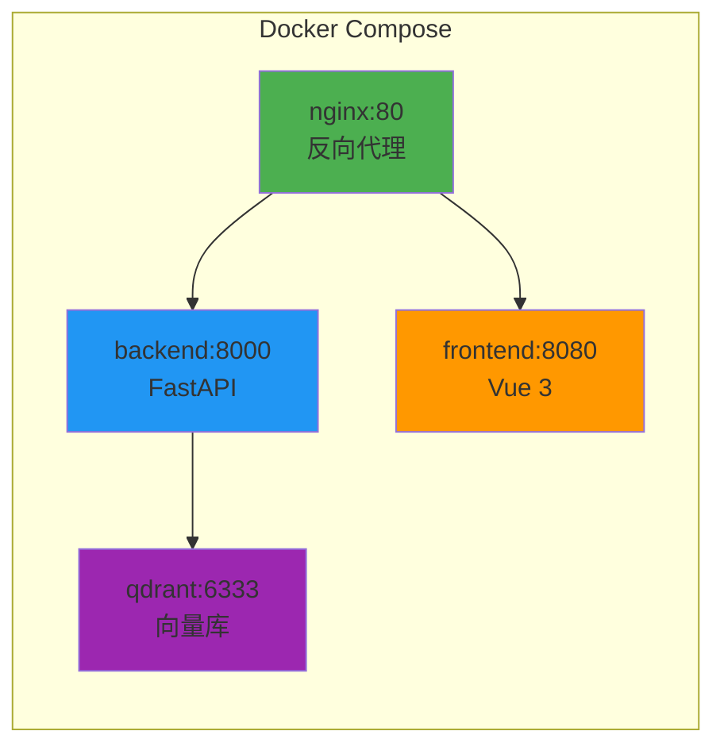

# 07 - 从开发到部署

## 本节目标

学完本节你能够：掌握项目的本地开发环境配置、Docker 容器化部署及常见问题排查。

---

## 项目结构

```
Agent/
├── backend/           # FastAPI 后端
│   ├── app/
│   │   ├── api/       # REST API 接口
│   │   ├── agent/     # 旧 Agent 模块（保留）
│   │   ├── graph/     # ★ LangGraph 新模块
│   │   ├── core/      # 会话 & 流管理
│   │   ├── config.py  # 配置
│   │   └── models.py  # 数据模型
│   └── .env           # 环境变量（API Key 等）
├── web/               # Vue 3 前端
│   └── src/
│       ├── components/ # 组件
│       ├── composables/ # 组合函数
│       └── api/        # API 客户端
├── rag/               # RAG 检索模块
│   ├── scripts/       # 数据脚本
│   ├── eval/          # RAGAS 评估
│   └── data/          # 商品数据
├── docs/teaching/     # 教学文件
└── docker-compose.yml # Docker 编排
```

## Docker 一键部署（推荐）



```bash
# 一键启动所有服务
docker compose up --build -d

# 查看日志
docker compose logs -f

# 查看单个服务日志
docker compose logs -f backend

# 停止所有服务
docker compose down

# 停止并清除数据
docker compose down -v

# 重新构建某个服务
docker compose up --build -d backend
```

## 本地开发环境

### 后端

```bash
cd backend
python -m venv .venv
source .venv/bin/activate
pip install -r requirements.txt

# 配置环境变量
cp .env.example .env
# 编辑 .env 填入 API Key

# 启动开发服务器
cd ..
PYTHONPATH=$(pwd) python -m uvicorn app.main:app --reload
```

### 前端

```bash
cd web
npm install
npm run dev
```

### RAG 数据准备

```bash
# 1. 爬取商品数据
PYTHONPATH=$(pwd) python rag/scripts/lining_scraper_v2.py

# 2. 向量化入库
PYTHONPATH=$(pwd) python rag/scripts/seed_data.py
```

## 环境变量配置

```bash
# backend/.env
LLM_API_KEY=your_deepseek_api_key
LLM_BASE_URL=https://api.deepseek.com/v1
LLM_MODEL=deepseek-chat
QDRANT_URL=your_qdrant_cloud_url
QDRANT_API_KEY=your_qdrant_api_key
```

## API 接口

| 端点 | 方法 | 用途 |
|------|------|------|
| `/api/v1/upload/image` | POST | 上传图片 |
| `/api/v1/chat` | POST | 创建聊天会话 |
| `/api/v1/chat/stream` | GET (SSE) | 流式读取回答 |
| `/api/v1/chat/stop` | POST | 停止生成 |
| `/api/v1/health` | GET | 健康检查 |

## 常见问题

**后端启动报 ModuleNotFoundError:**
确保 PYTHONPATH 指向项目根目录，从 `backend/` 内部启动。

**Docker 构建慢：**
首次构建需要下载 Python 和 Node 依赖，后续使用缓存会加速。

**前端 node_modules 损坏（Windows/Linux 切换）：**
```bash
cd web
rm -rf node_modules package-lock.json
npm install
```

**Qdrant 连接失败：**
检查 `.env` 中的 `QDRANT_URL` 和 `QDRANT_API_KEY` 配置是否正确。

## 小结

- Docker 一键启动是最快的部署方式
- 本地开发需分别启动后端和前端
- RAG 数据需要先爬取再入库
- 环境变量通过 `.env` 文件配置